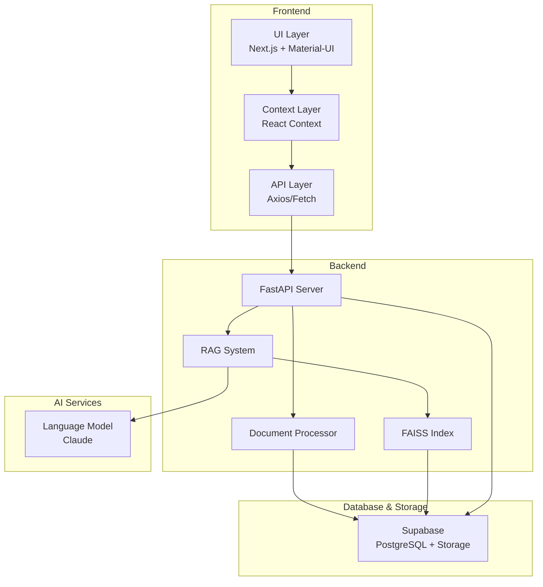

# ACAI Assistant - Dokumentacija Projekta / Project Documentation

## 🇷🇸 Srpski

### 📋 Za Nove Članove Tima
Dobrodošli u ACAI Assistant projekat! Ovaj dokument će vam pomoći da se upoznate sa projektom, njegovim ciljevima i trenutnim stanjem razvoja.

### 🎯 Vizija i Ciljevi Projekta
ACAI Assistant je nastao iz potrebe da se modernizuje proces učenja i učini dostupnijim svim učenicima. Naš cilj je da stvorimo inteligentnog asistenta koji će:

1. **Personalizovati Učenje**
   - Prilagođavanje načina objašnjavanja individualnom učeniku
   - Praćenje napretka i identifikacija oblasti koje treba unaprediti
   - Pružanje personalizovanih preporuka za učenje

2. **Pojednostaviti Pristup Znanju**
   - Brz pristup relevantnim informacijama iz različitih izvora
   - Interaktivno objašnjavanje kompleksnih koncepata
   - Mogućnost postavljanja potpitanja za bolje razumevanje

3. **Podržati Različite Stilove Učenja**
   - Tekstualni, vizuelni i interaktivni materijali
   - Praktični primeri i vežbe
   - Mogućnost povezivanja različitih oblasti znanja

### 💻 Trenutno Stanje Razvoja

#### Faza 1: Osnovna Infrastruktura (15.06.2024)
- ✅ Inicijalizacija projekta i postavka dokumentacije
- ✅ Definisanje osnovne arhitekture sistema
- ✅ Postavljanje razvojnog okruženja

#### Faza 2: Implementacija Core Funkcionalnosti (16.06.2024)
- ✅ Razvoj Next.js frontend aplikacije
- ✅ Implementacija FastAPI backend-a
- ✅ Integracija sa Supabase-om
- ✅ Postavka RAG sistema
- ✅ Sistem za upravljanje dokumentima

#### Faza 3: UI/UX Unapređenja (U Toku)
- ✅ Material-UI implementacija
- ✅ Responzivni dizajn
- ✅ Chat interfejs sa naprednim funkcijama
- 🚧 Sistem za praćenje napretka (U Razvoju)
- 📅 Interaktivni dashboard (Planirano)

### 🛠 Tehnički Stack

#### Frontend
- **Framework**: Next.js 14
- **Jezik**: TypeScript
- **UI Library**: Material-UI
- **State Management**: React Context
- **Stilizacija**: Tailwind CSS

#### Backend
- **Framework**: FastAPI
- **Jezik**: Python 3.11
- **Baza Podataka**: Supabase (PostgreSQL)
- **AI Integracija**: RAG sistem
- **Pretraga**: FAISS

### 📚 Kako Početi

1. **Preduslovi**
   ```bash
   # Node.js i npm
   node -v  # treba biti 18+
   npm -v   # treba biti 9+
   
   # Python
   python --version  # treba biti 3.11+
   ```

2. **Postavljanje Okruženja**
   ```bash
   # Frontend
   cd src/frontend
   npm install
   
   # Backend
   cd src/backend
   python -m venv venv
   source venv/bin/activate  # ili `venv\Scripts\activate` na Windows
   pip install -r requirements.txt
   ```

3. **Environment Varijable**
   - Kopirajte `.env.example` u `.env`
   - Popunite neophodne kredencijale
   - Zatražite pristup Supabase projektu od administratora

### 🗺 Mapa Puta

#### Q2 2024
- [ ] Sistem za praćenje napretka učenika
- [ ] Interaktivni dashboard
- [ ] Integracija sa dodatnim izvorima znanja

#### Q3 2024
- [ ] Sistem za generisanje vežbi
- [ ] Grupno učenje i kolaboracija
- [ ] Napredna analitika

#### Q4 2024
- [ ] Mobilna aplikacija
- [ ] Offline mod
- [ ] Integracija sa školskim sistemima

### 🏗 Arhitektura Sistema



#### Opis Komponenti

1. **Frontend Sloj**
   - **UI Layer**: Korisnički interfejs implementiran pomoću Next.js i Material-UI
   - **Context Layer**: Upravljanje stanjem aplikacije kroz React Context
   - **API Layer**: Komunikacija sa backend-om kroz HTTP zahteve

2. **Backend Sloj**
   - **FastAPI Server**: Glavni backend server koji upravlja zahtevima
   - **RAG System**: Sistem za pretragu i generisanje odgovora
   - **Document Processor**: Obrada i indeksiranje dokumenata
   - **FAISS Index**: Vektorska baza za semantičku pretragu

3. **Skladištenje Podataka**
   - **Supabase**: PostgreSQL baza i skladište za dokumente
   
4. **AI Servisi**
   - **Language Model**: Claude za generisanje odgovora

#### Tok Podataka
1. Korisnik interaguje sa UI-em
2. Context upravlja stanjem i šalje zahteve backend-u
3. Backend procesira zahteve kroz odgovarajuće komponente
4. RAG sistem kombinuje pretragu i AI generisanje
5. Rezultati se vraćaju kroz slojeve do korisnika

### 👥 Tim i Kontakt

#### Trenutni Tim
- **Tehnički Lead & Full-stack Developer**
  - Ime: Siniša Gazibara
  - Email: sgazza1971@proton.me
  - Uloga: Arhitektura sistema, razvoj core funkcionalnosti

#### Priključivanje Timu
Ako želite da se priključite razvoju ACAI Assistant-a:
1. Pošaljite email sa vašim iskustvom i interesovanjima
2. Pregledajte dokumentaciju i trenutno stanje projekta
3. Identifikujte oblasti u kojima možete doprineti

#### Komunikacija
- **Code Review**: Kroz GitHub pull requests
- **Diskusije**: Email komunikacija
- **Dokumentacija**: Ovaj repozitorijum

## 🇬🇧 English

### 📋 For New Team Members
Welcome to the ACAI Assistant project! This document will help you understand the project, its goals, and the current state of development.

### 🎯 Vision and Goals
ACAI Assistant was born from the need to modernize the learning process and make it more accessible to all students. Our goal is to create an intelligent assistant that will:

1. **Personalize Learning**
   - Adapt explanation methods to individual students
   - Track progress and identify areas for improvement
   - Provide personalized learning recommendations

2. **Simplify Access to Knowledge**
   - Quick access to relevant information from various sources
   - Interactive explanation of complex concepts
   - Ability to ask follow-up questions for better understanding

3. **Support Different Learning Styles**
   - Text, visual, and interactive materials
   - Practical examples and exercises
   - Ability to connect different areas of knowledge

### 💻 Current Development Status

#### Phase 1: Basic Infrastructure (15.06.2024)
- ✅ Project initialization and documentation setup
- ✅ Basic system architecture definition
- ✅ Development environment setup

#### Phase 2: Core Functionality Implementation (16.06.2024)
- ✅ Next.js frontend development
- ✅ FastAPI backend implementation
- ✅ Supabase integration
- ✅ RAG system setup
- ✅ Document management system

#### Phase 3: UI/UX Improvements (In Progress)
- ✅ Material-UI implementation
- ✅ Responsive design
- ✅ Advanced chat interface features
- 🚧 Progress tracking system (In Development)
- 📅 Interactive dashboard (Planned)

### 🛠 Technical Stack

#### Frontend
- **Framework**: Next.js 14
- **Language**: TypeScript
- **UI Library**: Material-UI
- **State Management**: React Context
- **Styling**: Tailwind CSS

#### Backend
- **Framework**: FastAPI
- **Language**: Python 3.11
- **Database**: Supabase (PostgreSQL)
- **AI Integration**: RAG system
- **Search**: FAISS

### 📚 Getting Started

1. **Prerequisites**
   ```bash
   # Node.js and npm
   node -v  # should be 18+
   npm -v   # should be 9+
   
   # Python
   python --version  # should be 3.11+
   ```

2. **Environment Setup**
   ```bash
   # Frontend
   cd src/frontend
   npm install
   
   # Backend
   cd src/backend
   python -m venv venv
   source venv/bin/activate  # or `venv\Scripts\activate` on Windows
   pip install -r requirements.txt
   ```

3. **Environment Variables**
   - Copy `.env.example` to `.env`
   - Fill in necessary credentials
   - Request Supabase project access from administrator

### 🗺 Roadmap

#### Q2 2024
- [ ] Student progress tracking system
- [ ] Interactive dashboard
- [ ] Integration with additional knowledge sources

#### Q3 2024
- [ ] Exercise generation system
- [ ] Group learning and collaboration
- [ ] Advanced analytics

#### Q4 2024
- [ ] Mobile application
- [ ] Offline mode
- [ ] School system integration

### 🏗 System Architecture

[Isti Mermaid dijagram kao gore]

#### Component Description

1. **Frontend Layer**
   - **UI Layer**: User interface implemented with Next.js and Material-UI
   - **Context Layer**: Application state management through React Context
   - **API Layer**: Backend communication through HTTP requests

2. **Backend Layer**
   - **FastAPI Server**: Main backend server handling requests
   - **RAG System**: Retrieval and generation system
   - **Document Processor**: Document processing and indexing
   - **FAISS Index**: Vector database for semantic search

3. **Data Storage**
   - **Supabase**: PostgreSQL database and document storage
   
4. **AI Services**
   - **Language Model**: Claude for response generation

#### Data Flow
1. User interacts with UI
2. Context manages state and sends requests to backend
3. Backend processes requests through appropriate components
4. RAG system combines search and AI generation
5. Results are returned through layers to user

### 👥 Team and Contact

#### Current Team
- **Technical Lead & Full-stack Developer**
  - Name: Siniša Gazibara
  - Email: sgazza1971@proton.me
  - Role: System architecture, core functionality development

#### Joining the Team
If you want to join ACAI Assistant development:
1. Send an email with your experience and interests
2. Review documentation and current project state
3. Identify areas where you can contribute

#### Communication
- **Code Review**: Through GitHub pull requests
- **Discussions**: Email communication
- **Documentation**: This repository

## 📝 Detailed Changelog / Detaljna Lista Promena

### 16.06.2024
- ✨ Implementiran napredni chat interfejs sa podrškom za editovanje poruka / Implemented advanced chat interface with message editing support
- 🔧 Integrisan RAG sistem sa Supabase skladištem / Integrated RAG system with Supabase storage
- 📱 Dodat responzivni dizajn i Material-UI komponente / Added responsive design and Material-UI components
- 🐛 Rešeni problemi sa otpremanjem dokumenata / Fixed document upload issues
- ⚙️ Poboljšane environment varijable i provere portova / Improved environment variables and port checks

### 15.06.2024
- 🚀 Inicijalno podešavanje projekta / Initial project setup
- 📋 Postavljena struktura dokumentacije / Documentation structure setup
- 🌐 Dodata dvojezična dokumentacija (Srpski/Engleski) / Added bilingual documentation (Serbian/English) 